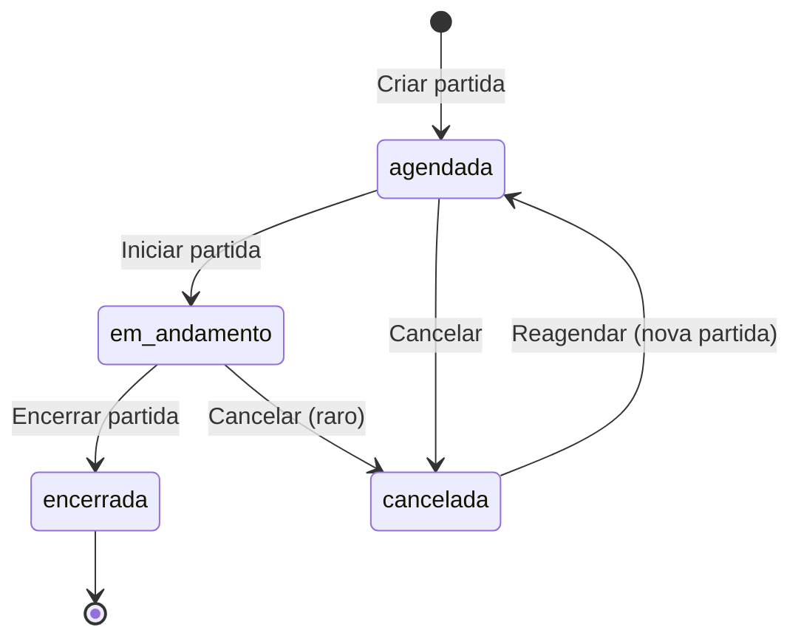

# RachãoApp — Documentação para o usuário final

> **Versão do app:** 0.1.0  
> **Idioma:** Português (Brasil)  
> **Última revisão:** maio de 2026  
> **Público deste documento:** material de apoio, tutoriais, FAQ e treinamento — não é manual técnico de instalação.

---

## Índice

1. [O que é o RachãoApp](#1-o-que-é-o-rachãoapp)
2. [Glossário — linguagem da pelada](#2-glossário--linguagem-da-pelada)
3. [Quem usa o quê — perfis e papéis](#3-quem-usa-o-quê--perfis-e-papéis)
4. [Como acessar o app](#4-como-acessar-o-app)
5. [Primeiros passos — conta e onboarding](#5-primeiros-passos--conta-e-onboarding)
6. [Guia do Presidente](#6-guia-do-presidente)
7. [Guia do Boleiro (sem conta)](#7-guia-do-boleiro-sem-conta)
8. [Guia do Dono do Estádio](#8-guia-do-dono-do-estádio)
9. [Vaquinha da pelada (PIX)](#9-vaquinha-da-pelada-pix)
10. [Planos e assinatura do app](#10-planos-e-assinatura-do-app)
11. [Notificações](#11-notificações)
12. [Links públicos e compartilhamento](#12-links-públicos-e-compartilhamento)
13. [App no celular (PWA) e modo offline](#13-app-no-celular-pwa-e-modo-offline)
14. [Ciclo de vida de uma partida](#14-ciclo-de-vida-de-uma-partida)
15. [Mapa completo de telas](#15-mapa-completo-de-telas)
16. [Perguntas frequentes (FAQ)](#16-perguntas-frequentes-faq)
17. [Limitações conhecidas na V1](#17-limitações-conhecidas-na-v1)

---

## 1. O que é o RachãoApp

O **RachãoApp** é uma plataforma web (site otimizado para celular) para **organizar peladas de futebol amador** no Brasil — do convite ao pagamento da vaquinha, passando por escalação de times e registro do jogo ao vivo.

### Proposta de valor (como o app se apresenta)

- **Para o Presidente:** criar grupos, agendar partidas, convidar boleiros, escalar times, registrar gols e cartões em tempo real, e controlar quem pagou a vaquinha.
- **Para o Boleiro:** responder convites por link (sem precisar criar conta), confirmar presença e ver escalação ou resultado quando o presidente compartilhar.
- **Para o Dono do Estádio:** cadastrar campo ou quadra, definir horários disponíveis, aprovar partidas que usam o espaço e ter uma página pública para divulgação.

### O que o app **não** é

| Expectativa incorreta | Realidade |
|----------------------|-----------|
| App nativo na App Store / Play Store | Não há app iOS/Android nativo; é **site responsivo** com opção de instalar como PWA |
| Cobrança automática PIX para boleiros | A vaquinha usa **chave PIX** configurada pelo presidente; o pagamento é feito **fora do app** (WhatsApp, banco etc.) |
| Conta obrigatória para todo jogador | Boleiros usam **link de convite**; só quem organiza ou tem estádio precisa de conta |
| Modo claro | Na V1 o tema é **escuro** (claro previsto para versão futura) |

### Fluxo geral do produto

```
Cadastro/Login → Escolher perfil(is) → Dashboard
       │
       ├── Presidente: Grupo → Boleiros → Partida (wizard) → Convites
       │       → Presenças → Escalação → Ao vivo → Resumo → Vaquinha
       │
       └── Dono do Estádio: Perfil do espaço → Agenda → Aprovar solicitações
```

---

## 2. Glossário — linguagem da pelada

| Termo | Significado no RachãoApp |
|-------|--------------------------|
| **Pelada / Rachão** | Partida informal de futebol amador; unidade central do produto |
| **Grupo** | Núcleo fixo de jogadores (ex.: “Pelada de terça”) |
| **Presidente** | Organizador com conta: convites, escalação, financeiro, ao-vivo |
| **Boleiro** | Jogador cadastrado no grupo; **não precisa** de conta no app |
| **Convidado avulso** | Jogador ocasional, identificado pelo **celular**; pode ser reutilizado em outras partidas |
| **Partida** | Evento com data, local, times, regras e convites |
| **Convite** | Link único enviado ao boleiro para confirmar ou recusar presença |
| **Lista de espera** | Quando as vagas lotam; boleiro entra na fila e pode ser promovido se alguém desistir |
| **Departamento médico (DM)** | Status de convite: lesionado ou indisponível (tom de humor do futebol amador) |
| **Escalação** | Distribuição dos jogadores nos times (titulares, reservas, capitão) |
| **Ao vivo** | Tela de registro do jogo: placar, cronômetro, gols, cartões, substituições |
| **Vaquinha** | Rateio do custo da pelada via PIX — **não** é a mensalidade do software |
| **Por partida** | Cobrança só de quem confirmou/presente naquela partida |
| **Mensalidade** | Boleiros fixos do grupo pagam o mês inteiro |
| **Inadimplente** | Quem não pagou no prazo; regras podem bloquear escalação |
| **Dono do Estádio** | Responsável por campo/quadra, agenda e aprovação de uso do local |
| **Vínculo / solicitação** | Pedido do presidente para usar um estádio cadastrado no app |
| **Série / recorrente** | Várias partidas semanais criadas de uma vez (mesmo `serieId`) |
| **Copresidente** | Outro usuário com acesso operacional ao mesmo grupo |
| **Trial / planos** | Assinatura do **software** RachãoApp (distinto da vaquinha) |

### Níveis de grupo

| Valor | Rótulo usual |
|-------|--------------|
| `casual` | Casual |
| `intermediario` | Intermediário |
| `competitivo` | Competitivo |

### Posições de jogo

| Código | Posição |
|--------|---------|
| GOL | Goleiro |
| ZAG | Zagueiro |
| MEI | Meio-campo |
| ATA | Atacante |

### Status da partida

| Status | O que significa para o usuário |
|--------|--------------------------------|
| **Agendada** | Partida marcada; convites, presenças, escalação e vaquinha disponíveis |
| **Ao vivo** (`em_andamento`) | Jogo em andamento; registrar eventos na tela Ao vivo |
| **Encerrada** | Jogo finalizado; resumo, estatísticas e links públicos de resultado |
| **Cancelada** | Partida não acontece; opção de reagendar |

---

## 3. Quem usa o quê — perfis e papéis

### 3.1 Perfis de conta

Um usuário cadastrado pode ter **um ou dois perfis**:

| Perfil | Código interno | O que faz |
|--------|----------------|-----------|
| **Presidente** | `presidente` | Grupos, partidas, boleiros, vaquinha, escalação, ao-vivo |
| **Dono do Estádio** | `dono_estadio` | Cadastro do espaço, agenda, aprovação de partidas |

- É possível **ativar o segundo perfil depois** em **Perfil pessoal** (`/perfil`).
- Se o usuário tem os dois perfis, ao entrar no app a prioridade é o **dashboard do Dono do Estádio** (mesma regra no botão “Ir para o app” na página inicial).

### 3.2 Papéis dentro do grupo

| Papel | Quem é | Permissões principais |
|-------|--------|------------------------|
| **Criador** | Quem criou o grupo | Tudo, inclusive **exclusão definitiva** do grupo |
| **Copresidente** | Outro presidente adicionado por e-mail | Operações normais (partidas, boleiros, vaquinha etc.) |

Para ser copresidente, a pessoa precisa **já ter conta** no RachãoApp com o e-mail informado.

### 3.3 Quem não tem login

| Persona | Como interage |
|---------|----------------|
| **Boleiro / convidado** | Link `/confirmar/[token]`; links públicos de escalação e resumo |
| **Visitante** | Landing, login, cadastro, página pública do estádio |

---

## 4. Como acessar o app

### Requisitos para o usuário final

- Navegador moderno no celular ou computador (Chrome, Safari, Edge, Firefox).
- Conexão com internet (exceto registro de eventos **durante** partida ao vivo com PWA ativo — ver seção 13).
- Para login com Google: conta Google válida.

### URLs principais (produção)

Substitua pelo domínio real quando publicado (ex.: `https://app.rachao.app`):

| Página | Caminho |
|--------|---------|
| Página inicial | `/` |
| Entrar | `/login` |
| Cadastrar | `/cadastro` |
| Recuperar senha | `/recuperar-senha` |

### Navegação no celular (Presidente)

Barra inferior fixa com quatro itens:

| Ícone / rótulo | Destino |
|----------------|---------|
| **Início** | `/dashboard` |
| **Grupos** | `/grupos` |
| **Partidas** | `/partidas` |
| **Conta** | Menu do usuário → perfil, planos, configurações |

### Navegação no celular (Dono do Estádio)

Barra inferior própria:

| Item | Destino |
|------|---------|
| Início | `/estadio/dashboard` |
| Perfil | `/estadio/perfil` |
| Agenda | `/estadio/agenda` |
| Solicitações | `/estadio/solicitacoes` |

### Desktop

O layout usa mais colunas em telas grandes. A barra inferior do presidente **some em telas médias/grandes** (`md+`); a navegação continua pelos links nas páginas e pelo menu do avatar.

---

## 5. Primeiros passos — conta e onboarding

### 5.1 Criar conta (`/cadastro`)

1. Informar **nome**, **e-mail** e **senha** (ou usar **Continuar com Google**).
2. Confirmar e-mail se o ambiente exigir verificação Supabase.
3. Ser redirecionado para **onboarding** ou dashboard conforme estado da conta.

### 5.2 Entrar (`/login`)

- E-mail e senha, ou Google.
- Link **Esqueci minha senha** → `/recuperar-senha`.

### 5.3 Recuperar senha

1. Em `/recuperar-senha`, informar o e-mail cadastrado.
2. Abrir o link recebido por e-mail.
3. Em `/atualizar-senha`, definir a nova senha.

### 5.4 Onboarding — 2 passos (`/onboarding`)

**Passo 1 — Escolher perfil(is)**

| Cartão | Descrição na UI | Benefícios listados |
|--------|-----------------|---------------------|
| **Presidente** | “Organizo peladas, escalo times e controlo a vaquinha do meu grupo” | Gerencio boleiros · Agendo e registro partidas · Controlo a vaquinha |
| **Dono do Estádio** | “Tenho um campo ou quadra e quero gerenciar minha agenda” | Cadastro meu espaço · Defino horários · Aprovo partidas no meu campo |

- Pode selecionar **um ou os dois**.
- Texto de apoio: *“Você pode ter os dois perfis ao mesmo tempo”* e *“você pode mudar depois”*.

**Passo 2 — Dados opcionais**

| Se escolheu… | Campos opcionais |
|--------------|------------------|
| Presidente | Nome do grupo, cidade |
| Dono do Estádio | Nome do estádio, cidade |

- Botão **Pular** cria só os perfis, sem grupo/estádio inicial.
- Ao finalizar, redirecionamento automático para o dashboard adequado.

### 5.5 Roteador de entrada (`/entrada`)

Após login, o sistema consulta o perfil e envia para:

- `/onboarding` — se não completou cadastro de perfil
- `/estadio/dashboard` — se tem perfil dono (prioridade)
- `/dashboard` — se é só presidente

---

## 6. Guia do Presidente

### 6.1 Dashboard (`/dashboard`)

**Objetivo:** visão rápida da operação da pelada.

O presidente vê tipicamente:

- **Próximas partidas** com contagem regressiva (badge de countdown).
- **Insights** do grupo: artilheiros, cartões, estatísticas agregadas (quando há histórico).
- Atalhos para criar partida ou acessar partidas em andamento.
- **Barra ao vivo** (`LiveMatchBar`): se há partida `em_andamento`, aparece placar e cronômetro mesmo fora da tela ao-vivo.

### 6.2 Grupos

#### Lista (`/grupos`)

- Todos os grupos em que o usuário é presidente ou copresidente.
- Estados: ativo / arquivado.
- Botão para **criar novo grupo**.

#### Criar / editar grupo (`/grupos/novo`, `/grupos/[id]/editar`)

| Campo | Descrição |
|-------|-----------|
| Nome | Nome da pelada (ex.: “Terça da Quadra”) |
| Nível | Casual, intermediário ou competitivo |
| Foto | Imagem do grupo (upload) |
| Descrição | Texto livre opcional |
| Tipo de cobrança padrão | Por partida ou mensalidade (pode ser alterado por partida) |

#### Detalhe do grupo (`/grupos/[id]`)

Três abas principais:

| Aba | Conteúdo |
|-----|----------|
| **Boleiros** | Lista de jogadores fixos; adicionar, editar, arquivar |
| **Partidas** | Partidas daquele grupo |
| **Estatísticas** | Números agregados (gols, cartões, etc.) |

**Ações comuns na aba Boleiros:**

- **Adicionar boleiro** (modal ou FAB no mobile): nome, celular, posição, apelido, e-mail opcional.
- **Arquivar** boleiro — some das convocações ativas, histórico preservado.
- **Promover convidado avulso** a boleiro fixo (quando aplicável).
- **Adicionar copresidente** por e-mail de usuário já cadastrado.

#### Ficha do boleiro (`/grupos/[id]/boleiros/[boleiroId]`)

- Dados cadastrais e posição.
- Bloco **financeiro**: histórico de pagamentos da vaquinha (mensalidade ou por partida).
- Útil para cobrança e para regras de inadimplência.

### 6.3 Partidas

#### Lista (`/partidas`)

Filtros disponíveis:

| Filtro | Mostra |
|--------|--------|
| Todas | Todas as partidas |
| Agendadas | Status `agendada` |
| Ao vivo | Status `em_andamento` |
| Encerradas | Status `encerrada` |
| Canceladas | Status `cancelada` |

Cada card exibe data, grupo, local, badge de status e atalho para o detalhe.

#### Wizard — criar partida (`/partidas/nova`)

**6 passos** (barra de progresso no topo):

| # | Passo | O que o presidente define |
|---|-------|---------------------------|
| 1 | **Local** | Estádio cadastrado (busca e vínculo) **ou** endereço livre; opção de **série semanal recorrente** |
| 2 | **Dados básicos** | Grupo, data/hora, nº de times (2–4), jogadores por time, reservas por time, confrontos/tempos, **tipo de cobrança** (por partida ou mensalidade) |
| 3 | **Boleiros** | Quem convidar: boleiros fixos do grupo + convidados avulsos |
| 4 | **Regras** | Regras da pelada (ligar/desligar cada uma — ver tabela abaixo) |
| 5 | **Vaquinha** | Ativar ou não cobrança PIX; valores e prazos |
| 6 | **Revisão** | Conferir tudo e **criar partida** |

**Regras disponíveis (passo 4):**

| Regra | Texto na UI | Efeito prático |
|-------|-------------|----------------|
| Cartão Azul | Suspensão temporária em vez de expulsão | Cartão azul com duração configurável no ao-vivo |
| Bloquear após vermelho | Quem levou vermelho na última partida não joga | Impede escalação de quem está bloqueado |
| Bloquear inadimplente | Boleiro com vaquinha em aberto não é escalado | Integração com status de pagamento |
| Gol olímpico vale 2 | Gol direto de escanteio conta como dois | No registro de gol, opção de gol olímpico |
| Impedimento ativo | Regra de offside aplicada | Referência nas regras da partida |
| Goleiro obrigatório | Todo time precisa de goleiro escalado | Validação na escalação |
| Time incompleto joga | Partida não cancela com um time menor | Permite jogo desbalanceado |
| Limite de pênaltis | Máximo de cobranças por tempo | Limite configurável |

**Após criar a partida:**

- Convites são gerados com links `/confirmar/[token]`.
- Se escolheu estádio cadastrado, status fica **pendente** até o dono aprovar.
- Presidente pode **reenviar convites** por e-mail, WhatsApp ou ambos.

#### Detalhe da partida (`/partidas/[id]`)

Hub central com status, resumo das regras, local, data e **grade de ações** conforme o status:

**Partida agendada:**

| Ação | Destino / função |
|------|------------------|
| Presenças | Lista de convites e confirmações |
| Escalação | Montar times |
| Vaquinha | Cobrança PIX |
| Reenviar convites | Modal de reenvio |

**Partida ao vivo:**

| Ação | Função |
|------|--------|
| Ao vivo | Registrar eventos |
| Escalação | Visualizar (edição limitada conforme regras) |
| Vaquinha | Acompanhar pagamentos |

**Partida encerrada:**

| Ação | Função |
|------|--------|
| Resumo | Placar, artilharia, cartões |
| Vaquinha | Fechar pendências |
| Repetir partida | Criar nova com base nesta |

**Partida cancelada:**

- Reagendar quando disponível.

Outras ações globais: **Iniciar partida** (muda para ao vivo), **Cancelar partida**.

### 6.4 Presenças (`/partidas/[id]/presencas`)

**Abas de filtro:**

| Aba | Conteúdo |
|-----|----------|
| Todos | Lista completa |
| Confirmados | Vão jogar |
| Pendentes | Ainda não responderam |
| Recusados | Não vão |
| DM | Departamento médico |
| Lista de espera | Aguardando vaga |

**O presidente pode:**

- Ver status de cada convite.
- Adicionar convidado avulso manualmente.
- Reenviar convite individual ou em lote.
- Acompanhar **lista de espera** — quando alguém desiste, o sistema pode promover automaticamente o próximo (com notificação).

**Status possíveis do convite:**

| Status | Significado |
|--------|-------------|
| Pendente | Aguardando resposta |
| Confirmado | Vai jogar |
| Recusado | Não vai |
| Lista de espera | Vagas lotadas; na fila |
| Departamento médico | Lesionado / indisponível |

### 6.5 Escalação (`/partidas/[id]/escalacao`)

**Modos:**

| Modo | Descrição |
|------|-----------|
| **Automático** | Sistema balanceia jogadores por posição (GOL, ZAG, MEI, ATA) |
| **Manual** | Presidente arrasta jogadores entre times |

**Recursos:**

- Definir **capitão** por time.
- **Reservas** além dos titulares.
- **Cores** dos times no campo visual.
- **Compartilhar** link público de escalação (plano pago; trial pode limitar).
- Regras podem **impedir** escalar inadimplentes ou quem levou vermelho na partida anterior.

**Preview para redes:** imagem OG gerada em `/api/og/escalacao/[token]`.

### 6.6 Partida ao vivo (`/partidas/[id]/ao-vivo`)

**Antes de iniciar:** na página da partida, usar **Iniciar partida**.

**Durante o jogo o presidente registra:**

| Evento | Ícone / tipo |
|--------|--------------|
| Gol | Com jogador, time, opção gol olímpico |
| Cartão amarelo | |
| Cartão vermelho | |
| Cartão azul | Se regra ativa — com duração |
| Substituição | Entra / sai |

**Cronômetro:**

- Controle de tempo por confronto / jogo.
- Estado sincronizado com servidor quando online.

**Classificação e tabelas:**

- Placar por confronto.
- Artilharia e estatísticas derivadas dos eventos.

**Encerrar partida:**

- Modal de confirmação.
- Gera resumo, preenche `encerradaEm`, pode expirar links públicos conforme configuração.

**Adicionar jogador durante o jogo:**

- Convidado avulso pode ser incluído via dialog dedicado.

### 6.7 Resumo (`/partidas/[id]/resumo`)

Após encerrar:

- Placar final por confronto.
- Artilheiros e estatísticas.
- Cartões aplicados.
- **Compartilhar** link público do resumo (`/partidas/publico/[token]/resumo`).

### 6.8 Notificações do presidente (`/notificacoes`)

Central com histórico de alertas (presença, vaquinha, estádio, cancelamentos etc.).

---

## 7. Guia do Boleiro (sem conta)

O boleiro **não precisa baixar app nem criar senha** para a função principal: responder convite.

### 7.1 Receber e abrir o convite

1. Presidente envia link (WhatsApp, e-mail, etc.).
2. Link formato: `/confirmar/[token]` — único por convite.
3. Tela personalizada: *“E aí, [nome]!”* com dados do grupo e da partida.

### 7.2 Informações exibidas

- Nome do **grupo** (com foto se houver).
- **Data e hora** formatadas.
- **Local** (se informado).
- Resumo: nº de times, vagas totais, duração em minutos.

### 7.3 Responder ao convite

| Botão | Ação |
|-------|------|
| **Vou jogar** | Confirma presença |
| **Não posso ir** | Recusa |
| **Estou no departamento médico** | Marca indisponibilidade por lesão/motivo médico |

- Campo opcional: **Recado pro grupo** (texto livre).
- Após responder, pode **alterar a resposta** enquanto o convite estiver ativo e a partida não tiver regras que impeçam.

### 7.4 Situações especiais

| Situação | Mensagem na tela |
|----------|------------------|
| Partida cancelada | “Esta partida foi cancelada” — aguardar contato do presidente |
| Link expirado | “Esse link não é mais válido” — pedir reenvio ao presidente |
| Lista de espera | Status “Lista de espera” — aguardar vaga |

### 7.5 O que o boleiro pode ver sem login

| Conteúdo | Como acessa |
|----------|-------------|
| Escalação | Link público `/partidas/publico/[token]/escalacao` (somente leitura) |
| Resumo / placar | Link público `/partidas/publico/[token]/resumo` após o jogo |

---

## 8. Guia do Dono do Estádio

### 8.1 Dashboard (`/estadio/dashboard`)

Visão de solicitações pendentes, próximas reservas e atalhos para agenda e perfil.

### 8.2 Perfil do estádio (`/estadio/perfil`)

Cadastro e manutenção do espaço:

| Campo / recurso | Descrição |
|-----------------|-----------|
| Nome, endereço, cidade, estado | Localização |
| Tipo de espaço | Campo, quadra, arena, salão |
| Tipo de piso | Grama natural, sintético, salão, areia, etc. (múltipla escolha) |
| Capacidade | Nº de jogadores |
| Comodidades | Lista (vestiário, estacionamento, etc.) |
| Descrição | Texto para página pública |
| Fotos | Capa e galeria |
| Slug | URL amigável: `/estadios/[slug]` |
| Visibilidade | Público na busca para presidentes; página pública on/off |

### 8.3 Agenda (`/estadio/agenda`)

**Visualizações:** mês, semana, dia.

**O dono gerencia:**

| Recurso | Função |
|---------|--------|
| **Horários disponíveis** | Por dia da semana (ex.: terça 19h–23h, intervalo de 60 min) |
| **Datas bloqueadas** | Feriados, manutenção, eventos externos |
| **Reservas manuais** | Bloqueio com nome e telefone de contato (aluguel fora do app) |

### 8.4 Solicitações (`/estadio/solicitacoes`)

Quando um presidente agenda partida em estádio cadastrado:

1. Solicitação criada com status **pendente**.
2. Dono vê dados da partida, grupo e observações.
3. **Aprovar** — partida segue normalmente; presidente é notificado.
4. **Recusar** — informar motivo; presidente é notificado.

Histórico mantido para auditoria (aprovadas, recusadas, todas).

### 8.5 Página pública (`/estadios/[slug]`)

Qualquer pessoa pode ver:

- Fotos e descrição.
- Endereço e comodidades.
- Informações para contato / divulgação.

**Não** permite reservar diretamente pelo visitante na V1 — reserva passa pelo presidente no wizard de partida.

---

## 9. Vaquinha da pelada (PIX)

### 9.1 Conceito

A **vaquinha** é o rateio do custo da pelada (aluguel da quadra, bola, etc.). O RachãoApp **não processa PIX automaticamente** — ele:

1. Armazena a **chave PIX** do presidente.
2. Mostra valores e prazos aos organizadores.
3. Permite **marcar manualmente** quem pagou, está pendente ou inadimplente.

Texto exibido no wizard: *“O controle de pagamentos é manual — você marca quem pagou depois da partida.”*

### 9.2 Tipos de cobrança

| Tipo | Quem entra na cobrança |
|------|------------------------|
| **Por partida** | Boleiros **confirmados** naquela partida (+ convidados avulsos confirmados) |
| **Mensalidade** | Todos os **boleiros fixos ativos** do grupo no mês calendário |

O tipo pode ser definido no **grupo** (padrão) e ajustado por **partida**.

### 9.3 Configuração (wizard passo 5 ou tela da partida)

| Campo | Descrição |
|-------|-----------|
| Ativar vaquinha | Liga/desliga cobrança |
| Tipo de chave PIX | CPF, CNPJ, telefone, e-mail ou aleatória |
| Chave PIX | Valor da chave |
| Valor boleiro fixo | Valor para jogador do grupo |
| Valor convidado avulso | Pode ser igual ou diferente |
| Data limite pagamento | Prazo para fixos |
| Data limite convidados | Prazo separado para avulsos (opcional) |

### 9.4 Tela de gestão (`/partidas/[id]/vaquinha`)

O presidente:

- Vê lista de pagadores com status: **pago**, **pendente**, **inadimplente**.
- Marca pagamentos individualmente.
- Usa **cobrança em lote** (pendentes, inadimplentes ou seleção manual).
- Consulta totais arrecadados vs. esperado.

### 9.5 Regra de bloqueio

Se a regra **Bloquear inadimplente** estiver ativa na partida, boleiros com vaquinha em aberto **não aparecem disponíveis na escalação**.

### 9.6 Distinção importante: Vaquinha × Plano do app

| | Vaquinha | Plano RachãoApp |
|---|----------|-----------------|
| **O que é** | Dinheiro da pelada entre jogadores | Assinatura do software |
| **Quem paga** | Boleiros ao presidente | Presidente e/ou dono do estádio |
| **Como paga** | PIX externo (manual) | Asaas: PIX, cartão ou boleto |
| **Onde configura** | Wizard / tela da partida | `/planos` |

---

## 10. Planos e assinatura do app

> **Precificação e limites em revisão.** A política alvo (quotas de e-mail, SMS, WhatsApp API, 1 grupo, partidas/semana, até 40 boleiros) está em [`politica-notificacoes-e-planos.md`](politica-notificacoes-e-planos.md). A tabela abaixo reflete a **UI atual** (`/planos`), que ainda não aplica todos os limites no backend.

### 10.1 Tabela comparativa (como exibida em `/planos`)

| Recurso | Trial (14 dias) | Presidente R$ 19,90/mês | Dono Estádio R$ 29,90/mês | Combo R$ 39,90/mês |
|---------|-----------------|---------------------------|---------------------------|---------------------|
| Grupos | 1 | Ilimitados | — | Ilimitados |
| Boleiros | 15 | Ilimitados | — | Ilimitados |
| Partidas/mês | 3 | Ilimitadas | — | Ilimitadas |
| Histórico | 30 dias | Completo | — | Completo |
| Escalação | ✓ | ✓ | — | ✓ |
| Vaquinha | ✓ | ✓ | — | ✓ |
| Compartilhar links | ✗ | ✓ | — | ✓ |
| Perfil estádio | — | — | ✓ | ✓ |
| Agenda / vínculos | — | — | ✓ | ✓ |

### 10.2 Assinar

1. Ir em **Conta → Planos e assinatura** ou `/planos`.
2. Escolher plano pago.
3. Selecionar forma: **PIX**, **cartão de crédito** ou **boleto** (via Asaas).
4. Completar pagamento no link do gateway quando exibido.

**Status da assinatura:**

| Status | Significado |
|--------|-------------|
| Ativa | Plano em dia |
| Aguardando pagamento | Pendente confirmação |
| Inadimplente | Pagamento em atraso |
| Cancelada | Encerrada |

É possível **cancelar assinatura** (mantém até fim do ciclo conforme regra do gateway).

### 10.3 Trial

- 14 dias gratuitos com limites da tabela.
- Contador de dias restantes visível na tela de planos.
- Ao expirar, funcionalidades limitadas até assinar.

---

## 11. Notificações

### 11.0 Como os avisos chegam (hoje vs planejado)

| Momento | Hoje (V1) | Planejado (ver política de canais) |
|---------|-------------|-------------------------------------|
| 1º convite ao boleiro | E-mail automático; WhatsApp = presidente abre `wa.me` e envia manualmente | E-mail; **SMS** se não tiver e-mail; sem WhatsApp API no 1º toque |
| Lembrete ~24h antes | Notificação **in-app** para o presidente | **WhatsApp API** só para boleiros **pendentes**; presidente continua in-app |
| Cobrança vaquinha | Links `wa.me` pelo presidente | Idem no plano base; API opcional em add-on |

Detalhes, custos e quotas por plano: [`politica-notificacoes-e-planos.md`](politica-notificacoes-e-planos.md).

### 11.1 Onde configurar

**Configurações → Notificações** (`/configuracoes/notificacoes`)

### 11.2 Canais globais

| Canal | Descrição |
|-------|-----------|
| E-mail | Alertas por e-mail |
| WhatsApp | Alertas por WhatsApp (quando integrado no backend) |

Desligar um canal global desabilita os toggles daquele canal na tabela de eventos.

### 11.3 Eventos — Presidente

| Código | Texto na UI |
|--------|-------------|
| presenca_confirmada | Boleiro confirmou presença |
| presenca_recusada | Boleiro recusou presença |
| lista_espera_promovido | Vaga aberta na lista de espera |
| partida_24h | Lembrete de partida (24h antes) |
| vaquinha_pendente | Vaquinha pendente |
| estadio_aprovado | Dono do Estádio aprovou vínculo |
| estadio_recusado | Dono do Estádio recusou vínculo |
| partida_cancelada | Partida cancelada |

### 11.4 Eventos — Dono do Estádio

| Código | Texto na UI |
|--------|-------------|
| nova_solicitacao | Nova solicitação de vínculo |
| presidente_cancelou_partida | Presidente cancelou partida |

Cada evento pode ter e-mail e WhatsApp **ligados ou desligados** individualmente.

### 11.5 Central de notificações

`/notificacoes` — histórico de alertas para consulta (sino no header do presidente).

---

## 12. Links públicos e compartilhamento

| Tipo | URL | Quem vê | Expiração |
|------|-----|---------|-----------|
| Convite presença | `/confirmar/[token]` | Boleiro convidado | Sim — pedir reenvio |
| Escalação pública | `/partidas/publico/[token]/escalacao` | Qualquer um com link | Conforme `expiresAt` |
| Resumo público | `/partidas/publico/[token]/resumo` | Qualquer um com link | Após encerrar + regra de expiração |
| Página do estádio | `/estadios/[slug]` | Público | Enquanto estádio ativo |

**Compartilhar escalação (presidente):**

- Modal com link e botão nativo **Compartilhar** (Web Share API no celular).
- Imagem de preview para redes sociais (Open Graph).

---

## 13. App no celular (PWA) e modo offline

### 13.1 Instalar no celular

Quando o administrador habilita `NEXT_PUBLIC_PWA_ENABLED=true`:

1. Abrir o site no Chrome/Safari.
2. **Adicionar à tela inicial** / **Instalar app**.
3. Ícone na home abre em modo standalone (sem barra do navegador).

Manifesto: nome **RachãoApp**, tema escuro, orientação retrato, `start_url` `/dashboard`.

### 13.2 O que funciona offline

| Funcionalidade | Offline? |
|----------------|----------|
| Login, grupos, listas | Não — precisa internet |
| **Registro ao-vivo** (gols, cartões) | **Sim** — fila local (IndexedDB) |
| Sincronização | Automática ao voltar online |

Na tela ao-vivo, ícone de **Wi-Fi / Wi-Fi off** indica estado. Eventos pendentes são reenviados com **idempotência** (`clientId`) para não duplicar.

### 13.3 Barra de partida ao vivo

Fora da tela ao-vivo, se há partida `em_andamento`, uma **barra fixa inferior** mostra placar e tempo — útil para acompanhar enquanto navega no app.

---

## 14. Ciclo de vida de uma partida



### Checklist operacional do presidente

| Fase | Tarefas |
|------|---------|
| **Antes** | Criar partida → convidar → aguardar presenças → escalar → cobrar vaquinha (opcional) → aguardar aprovação do estádio (se aplicável) |
| **Dia do jogo** | Iniciar partida → registrar eventos ao-vivo → encerrar |
| **Depois** | Conferir resumo → fechar vaquinha → compartilhar resultado → repetir partida (opcional) |

### Partida com estádio vinculado

| statusEstadio | Significado |
|---------------|-------------|
| sem_estadio | Endereço livre ou sem vínculo |
| pendente | Aguardando dono |
| aprovado | Pode jogar no local |
| recusado | Presidente deve alterar local ou recorrer ao dono |

---

## 15. Mapa completo de telas

Referência cruzada com IDs do projeto (`Prompt/rachaoapp-indice-telas.md`):

| ID | Tela | URL | Perfil |
|----|------|-----|--------|
| T01 | Landing | `/` | Público |
| T02 | Login | `/login` | Público |
| T03 | Cadastro | `/cadastro` | Público |
| T04 | Onboarding | `/onboarding` | Novo usuário |
| T05 | Recuperar senha | `/recuperar-senha` | Público |
| T06 | Confirmar presença | `/confirmar/[token]` | Boleiro |
| T07 | Dashboard presidente | `/dashboard` | Presidente |
| T08 | Lista de grupos | `/grupos` | Presidente |
| T09 | Criar/editar grupo | `/grupos/novo`, `/grupos/[id]/editar` | Presidente |
| T10 | Detalhe do grupo | `/grupos/[id]` | Presidente |
| T11 | Ficha do boleiro | `/grupos/[id]/boleiros/[id]` | Presidente |
| T12 | Modal boleiro | (modal) | Presidente |
| T13 | Wizard partida | `/partidas/nova` | Presidente |
| T14 | Detalhe partida | `/partidas/[id]` | Presidente |
| T15 | Presenças | `/partidas/[id]/presencas` | Presidente |
| T16 | Reenviar convites | (modal) | Presidente |
| T17 | Notificações | `/notificacoes` | Logado |
| T18 | Escalação | `/partidas/[id]/escalacao` | Presidente |
| T19 | Share escalação | (modal) | Presidente |
| T20 | Ao vivo | `/partidas/[id]/ao-vivo` | Presidente |
| T21 | Encerrar partida | (modal) | Presidente |
| T22 | Resumo | `/partidas/[id]/resumo` | Presidente + público |
| T23 | Vaquinha | `/partidas/[id]/vaquinha` | Presidente |
| T24–T25 | Modais cobrança/vaquinha | (modais) | Presidente |
| T26 | Dashboard estádio | `/estadio/dashboard` | Dono |
| T27 | Perfil estádio | `/estadio/perfil` | Dono |
| T28 | Agenda | `/estadio/agenda` | Dono |
| T29 | Solicitações | `/estadio/solicitacoes` | Dono |
| T30 | Página pública estádio | `/estadios/[slug]` | Público |
| T31 | Perfil pessoal | `/perfil` | Logado |
| T32 | Planos | `/planos` | Logado |
| T33 | Notificações (prefs) | `/configuracoes/notificacoes` | Logado |
| T34 | Configurações | `/configuracoes` | Logado |

**Telas adicionais implementadas além do índice original:**

| URL | Função |
|-----|--------|
| `/entrada` | Roteador pós-login |
| `/atualizar-senha` | Nova senha |
| `/partidas` | Lista de partidas |
| `/partidas/publico/[token]/escalacao` | Escalação pública |
| `/partidas/publico/[token]/resumo` | Resumo público |

---

## 16. Perguntas frequentes (FAQ)

### Conta e acesso

**Preciso pagar para usar o app?**  
Há **14 dias de trial** gratuito com limites. Depois, planos pagos liberam recursos ilimitados e compartilhamento de links.

**Posso ser presidente e dono de estádio?**  
Sim. Escolha os dois no onboarding ou ative o segundo em Perfil.

**Esqueci a senha.**  
Use `/recuperar-senha` com o mesmo e-mail do cadastro.

### Boleiros e convites

**O boleiro precisa instalar o app?**  
Não. Basta abrir o link do convite no navegador.

**O link não abre / diz expirado.**  
Peça ao presidente para **reenviar o convite** em Presenças.

**Confirmei por engano.**  
Enquanto o convite estiver ativo, use os botões na mesma página para mudar para “Não posso ir” ou DM.

### Partidas e estádio

**Marquei um estádio cadastrado e a partida ficou pendente.**  
O **dono do estádio** precisa aprovar em Solicitações. Até lá, trate como reserva não confirmada.

**Como faço partida toda semana?**  
No passo **Local** do wizard, use a opção de **série semanal recorrente**.

### Vaquinha

**O app cobra o PIX do boleiro automaticamente?**  
Não. O app mostra a chave e valores; o boleiro paga pelo banco/WhatsApp; o presidente **marca como pago** manualmente.

**Qual a diferença entre mensalidade e por partida?**  
**Por partida:** só quem confirmou naquela data. **Mensalidade:** todos os fixos do grupo no mês.

### Escalação e ao-vivo

**Não consigo escalar um jogador.**  
Verifique: inadimplência (regra ativa), bloqueio por vermelho anterior, ou status do convite (precisa confirmado).

**Perdi internet durante o jogo.**  
Com PWA ativo, continue registrando eventos; eles sincronizam ao voltar online.

### Planos

**O que ganho no plano Presidente?**  
Grupos, boleiros e partidas ilimitados; histórico completo; **compartilhar** links de escalação.

**Trial acabou. O que acontece?**  
Limites voltam (1 grupo, 15 boleiros, 3 partidas/mês, histórico 30 dias, sem share).

---

## 17. Limitações conhecidas na V1

| Item | Detalhe |
|------|---------|
| Idioma | Apenas português (BR) |
| Tema | Apenas escuro |
| App nativo | Não disponível |
| Sidebar desktop (presidente) | Não implementada — navegação por links e header |
| Cobrança PIX vaquinha | Manual, sem integração bancária |
| WhatsApp notificações | Depende de configuração backend |
| Reserva direta na página pública do estádio | Não — fluxo via presidente |
| Termos e privacidade | Links para `rachao.app/termos` e `rachao.app/privacidade` |

---

## Apêndice A — Sugestão de fatiamento para material de apoio

Este documento pode ser dividido em entregáveis menores:

| Documento sugerido | Seções fonte |
|--------------------|--------------|
| **Guia rápido do Presidente** | 5, 6, 9, 14 |
| **Cartão do Boleiro** (1 página) | 7 |
| **Manual do Dono do Estádio** | 8 |
| **FAQ comercial / planos** | 10, 16 |
| **Glossário para suporte** | 2 |
| **Roteiro de onboarding em vídeo** | 5 + 6.3 (wizard) |

---

## Apêndice B — Contato e suporte (usuário final)

Configurado pelo administrador da instalação:

- **WhatsApp:** variável `NEXT_PUBLIC_SUPORTE_WHATSAPP` — botão em Configurações se preenchido.
- **E-mail:** `NEXT_PUBLIC_SUPORTE_EMAIL` (padrão `suporte@rachao.app`).

Mensagem padrão do WhatsApp: *“Olá! Preciso de ajuda com o RachãoApp.”*

---

## Apêndice C — Referências internas do projeto

Para equipe técnica e atualização desta documentação:

| Recurso | Caminho |
|---------|---------|
| PRD | `Prompt/rachaoapp-prd-v1.md` |
| Índice de telas | `Prompt/rachaoapp-indice-telas.md` |
| Specs por bloco | `Prompt/rachaoapp-telas-bloco*.md` |
| Identidade visual | `Prompt/rachaoapp-identidade-visual.md` |
| Notificações, SMS/WA e planos (quotas) | `docs/politica-notificacoes-e-planos.md` |
| Divulgação Instagram (presidente) | `docs/divulgacao-instagram-presidente-cards.md` |
| QA por fase | `docs/qa-*.md` |

---

*Documento gerado a partir da análise do código e especificações do repositório RachaoApp. Atualize quando novas funcionalidades forem lançadas.*
